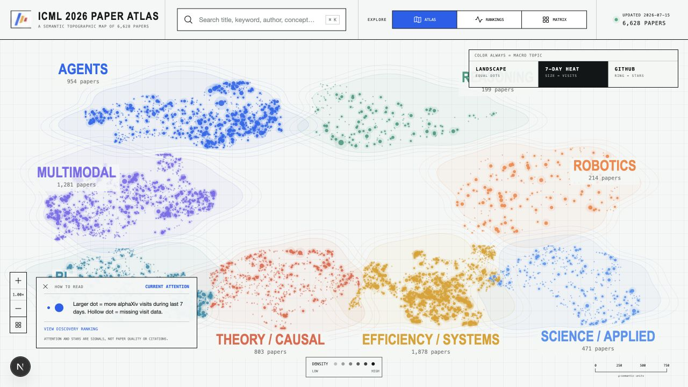

<div align="center">
  
  <h1>ICML 2026 Paper Atlas</h1>
  <p><strong>See the field, not just the feed.</strong></p>
  <p>An interactive semantic atlas for exploring 6,628 ICML 2026 papers, their topics, attention, open-source adoption, and relationships.</p>
  <p><a href="README.zh.md">中文</a> · <a href="https://icml-2026-paper-atlas.vercel.app">Live demo</a></p>
  <p>
    <a href="https://github.com/MisterBrookT/icml-2026-paper-atlas/stargazers"></a>
    
    
    <a href="LICENSE"></a>
  </p>
</div>



## Why

Paper lists answer “what was published?” Atlas answers three more useful questions:

- **Overview:** What is the field working on?
- **Explore:** Which subtopics, methods, and representative papers define an area?
- **Understand:** What does one paper contribute, and which work is most closely related?

## What it does

| Surface | Question | Signal |
| --- | --- | --- |
| **Atlas** | Where does a paper sit in the field? | Semantic position, macro topic, subtopic |
| **Attention** | What is being read now? | Node size = alphaXiv visits in the last 7 days |
| **Open Source** | Which papers have adopted repositories? | Outer ring = GitHub Stars |
| **Rankings** | Which papers have the strongest discovery signals? | Separate stacked segments for visits, votes, and Stars |
| **Matrix** | Which methods appear in which topics? | Topic × Method count or median attention percentile |
| **Focus reader** | What does this paper do and why is it related? | Full abstract, metadata, and ranked combined relationships |

The map supports semantic zoom up to 10×. Labels progressively reveal subtopics, representative papers, metrics, methods, and tasks. Selecting a paper preserves the current zoom and opens a context-aware reader.

## Run locally

Requires Node.js 22.13 or newer.

```bash
git clone https://github.com/MisterBrookT/icml-2026-paper-atlas.git
cd icml-2026-paper-atlas
npm install
npm run dev
```

Open [http://localhost:3000](http://localhost:3000).

```bash
npm run lint
npm test
```

## Data and taxonomy

- Paper metadata, abstracts, keywords, semantic source coordinates, visits, votes, and repository metadata come from [alphaXiv](https://www.alphaxiv.org/icml).
- The eight macro topics are stable product navigation anchors, not inherited alphaXiv categories.
- Papers are assigned by cosine similarity between `Xenova/all-MiniLM-L6-v2` embeddings and the eight semantic anchors.
- Subtopics are deterministic clusters inside each macro topic; labels come from distinctive TF-IDF phrases.
- Each paper stores its top 12 semantic neighbors. The browser never loads the original 384-dimensional embeddings.

Refresh source metrics and rebuild the semantic layout:

```bash
npm run atlas:refresh
npm run atlas:github
```

The layout builder expects the embedding model under `work/models/`. Caches and intermediate files are resumable, content-addressed, and excluded from Git.

## Interpretation limits

Visits, votes, and GitHub Stars are shown separately. They are attention and adoption signals—not paper quality, scientific impact, or citation counts. Missing metrics remain visually missing rather than being presented as zero. The current dataset is a snapshot and may differ from the live alphaXiv feed.

## Stack

Next.js 16, React 19, Canvas 2D, Transformers.js, MiniLM embeddings, seeded UMAP, and a static 6,628-paper map payload.

## License

[MIT](LICENSE) © 2026 Yinghao Tang.
